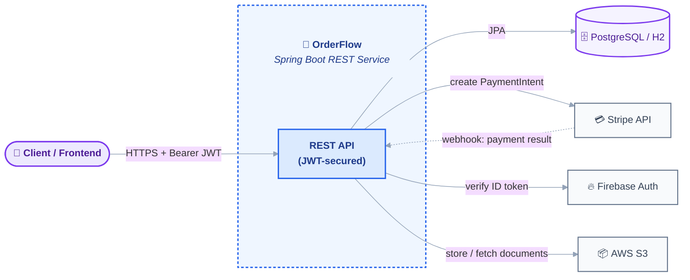
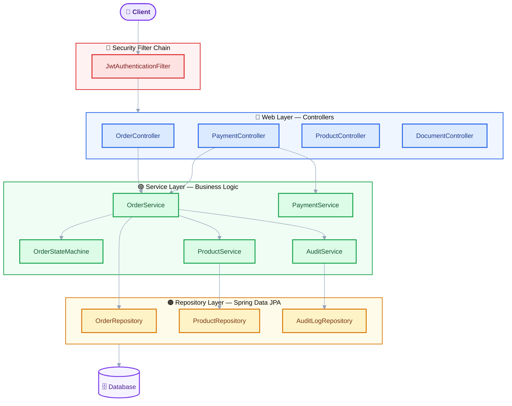
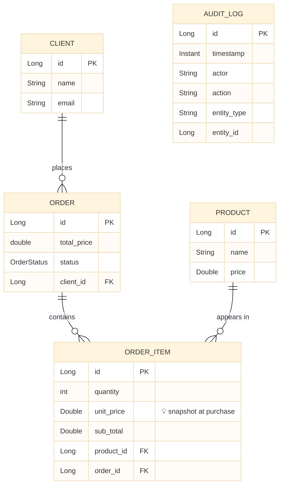
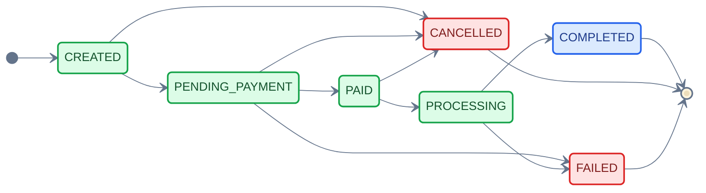
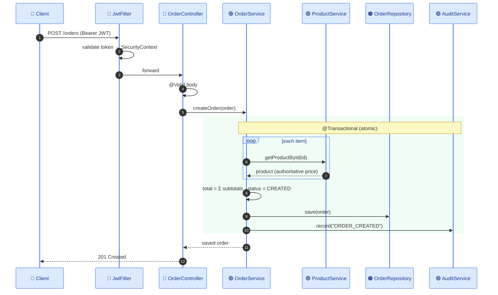
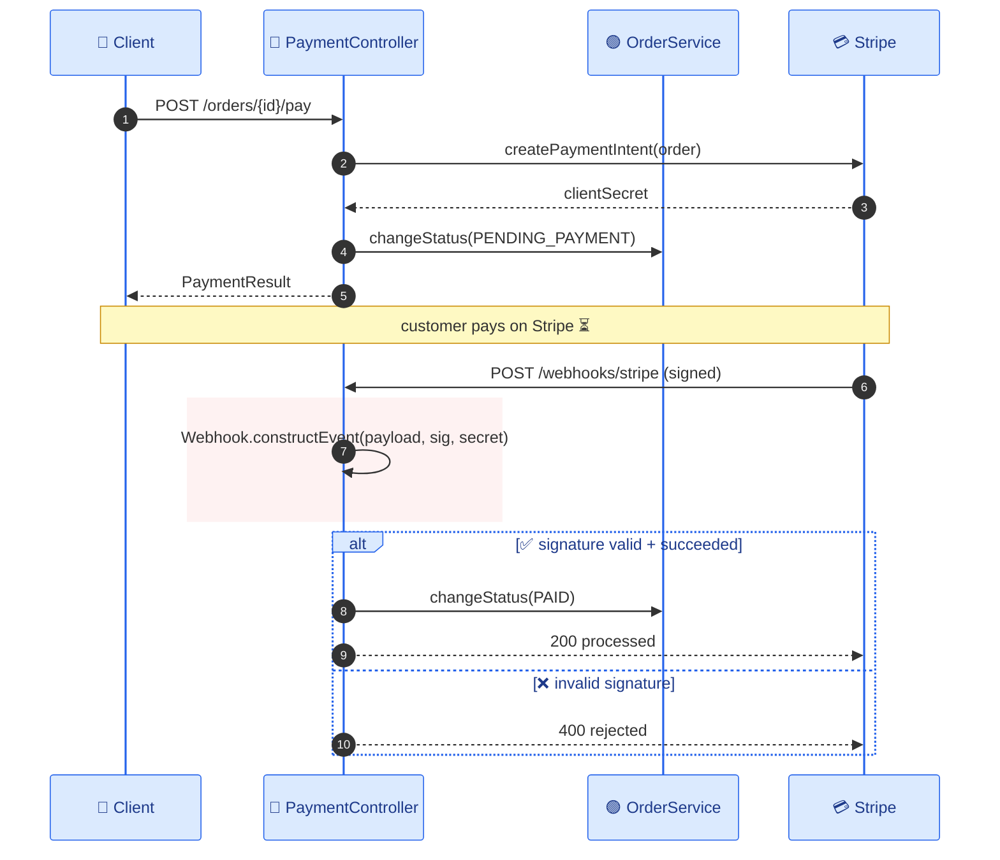

# OrderFlow — Architecture & Design Diagrams

> **To export for slides:** open https://mermaid.live → paste one ```mermaid``` block → menu **Actions → SVG** (crisp at any size) or PNG.
> Consistent palette: 🟣 client · 🔴 security · 🔵 web · 🟢 service · 🟠 repository · 🟪 database · ⚪ external.

---
## 1. System Context



---
## 2. Layered Architecture



---
## 3. Domain Model (ER)



---
## 4. Order State Machine ⭐ (showpiece)



---
## 5. Create-Order Request Lifecycle (sequence)



---
## 6. Payment Flow — async + webhook signature verification ⭐


