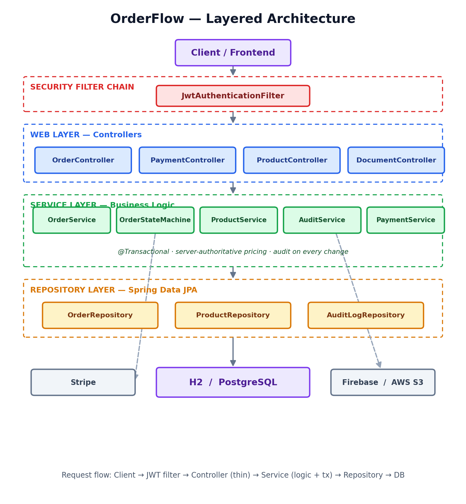
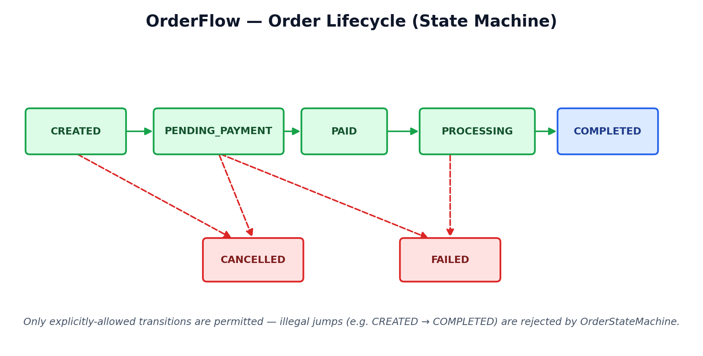
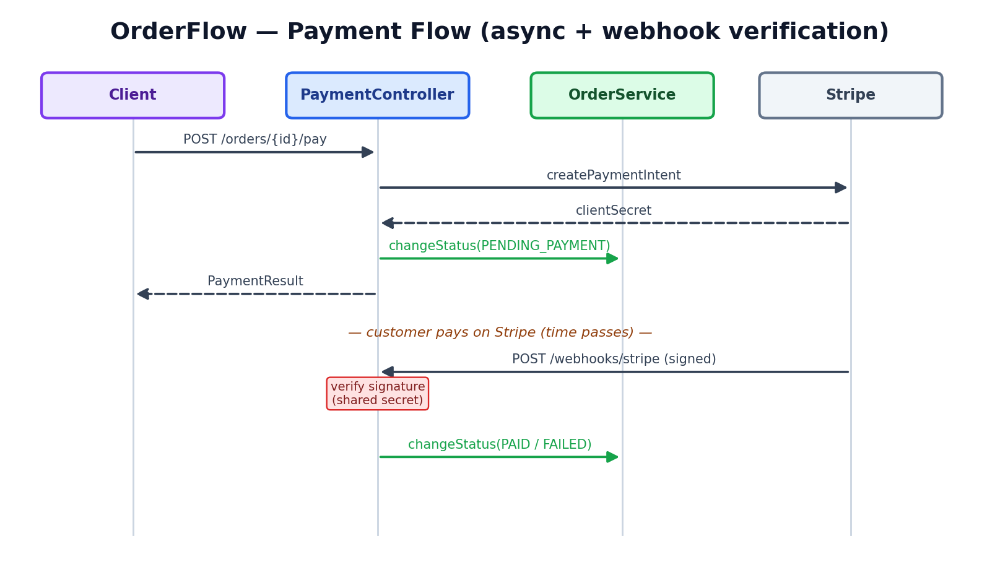

# Orderflow API

Production-style Spring Boot REST API modelling a banking order-processing workflow: clients, products, and orders with explicit state transitions, audit logging, payments, and document storage.

> Spring Boot 3.3 · Java 17 · H2 (development) / PostgreSQL (production) · JWT · Stripe · Firebase · AWS S3

---

## Table of Contents

- [Quick Start](#quick-start)
- [Features](#features)
- [Tech Stack](#tech-stack)
- [Architecture at a Glance](#architecture-at-a-glance)
- [Getting Started](#getting-started)
  - [Prerequisites](#prerequisites)
  - [Run Locally (No Setup)](#run-locally-no-setup)
  - [Run with PostgreSQL & Docker](#run-with-postgresql--docker)
  - [Environment Variables](#environment-variables)
  - [Integration Configuration](#integration-configuration)
- [API Documentation](#api-documentation)
- [Authentication](#authentication)
- [Testing](#testing)
- [Project Layout](#project-layout)
- [Key Endpoints](#key-endpoints)
- [Security Notes](#security-notes)

---

## Quick Start

Run the API **immediately with zero setup** (uses in-memory H2 database):

```bash
# Windows
mvnw.cmd spring-boot:run

# macOS / Linux
./mvnw spring-boot:run
```

The API starts on **`http://localhost:8080`**.

**Access Swagger UI:** `http://localhost:8080/swagger-ui/index.html`

**Default credentials:**
- Admin: `admin` / `admin123`
- User: `user` / `user123`

---

## Features

- **CRUD APIs** for `Client`, `Product`, and `Order`
- **Banking order workflow** with validated state machine:
  - `CREATED` → `PENDING_PAYMENT` → `PAID` → `PROCESSING` → `COMPLETED`
  - Plus: `CANCELLED`, `FAILED`
- **Audit logging** of order, payment, and document events with acting user
- **Role-based access control (RBAC)**: `ADMIN` and `USER` roles with method-level security
- **Stripe payment integration** with webhook handling
- **Firebase Authentication** (exchange Firebase ID token for app JWT)
- **AWS S3 document storage** for order attachments
- **Request validation** and global exception handling
- **OpenAPI/Swagger UI** for interactive API testing
- **JWT-based authentication** with Spring Security
- **In-memory H2** (development) / **PostgreSQL** (production)
- **Dockerized** with Docker Compose

---

## Tech Stack

| Layer | Technology |
|-------|-----------|
| Language / Runtime | Java 17 |
| Framework | Spring Boot 3.3.5 (Web, Data JPA, Security, Validation, Actuator) |
| Database | H2 in-memory (development) · PostgreSQL 14+ (production) |
| Auth | Spring Security + JWT (`jjwt` 0.12.6), BCrypt |
| Payments | Stripe Java SDK 26.7.0 |
| Auth Services | Firebase Admin SDK 9.3.0 |
| File Storage | AWS SDK v2 (S3) 2.25.60 |
| API Docs | springdoc-openapi 2.6.0 (Swagger UI) |
| Build | Maven 3.9+ (wrapper included) |
| Testing | JUnit 5, Spring Test, MockMvc |
| Packaging | Docker + Docker Compose |

---

## Architecture at a Glance

A layered Spring Boot service — requests pass through a JWT security filter, into thin controllers, down to services that hold the business logic and transactions, and out to Spring Data JPA repositories. External integrations (Stripe, Firebase, AWS S3) sit behind interfaces with safe local fallbacks.



The **order lifecycle** is the heart of the system — an explicit state machine that rejects illegal transitions (e.g. `CREATED → COMPLETED` skipping payment):



Payment is **asynchronous**, confirmed later by a **signature-verified Stripe webhook**:



A full diagram set (with editable Mermaid sources) lives in **[DIAGRAMS.md](DIAGRAMS.md)**.

---

## Getting Started

### Prerequisites

- **JDK 17** (any distribution)
- Maven is **not** required — use the bundled `./mvnw` or `mvnw.cmd`

### Run Locally (No Setup)

The app defaults to an **in-memory H2 database**. No database server needed:

```bash
# Windows
mvnw.cmd spring-boot:run

# macOS / Linux
./mvnw spring-boot:run
```

Opens on `http://localhost:8080`.

**Access Swagger UI:**
- URL: `http://localhost:8080/swagger-ui/index.html`

**Access H2 Console** (view/query in-memory data):
- URL: `http://localhost:8080/h2-console`
- JDBC URL: `jdbc:h2:mem:orderflow_db`
- User: `sa`
- Password: (leave empty)

**Login to get JWT token:**

```bash
curl -X POST http://localhost:8080/auth/login \
  -H "Content-Type: application/json" \
  -d '{"username":"admin","password":"admin123"}'
```

Response:
```json
{
  "token": "eyJhbGciOiJIUzI1NiIsInR5cCI6IkpXVCJ9...",
  "expiresIn": 3600
}
```

Use the token for subsequent requests:
```bash
curl -H "Authorization: Bearer <token>" http://localhost:8080/orders
```

---

### Run with PostgreSQL & Docker

For persistent data, use Docker Compose with PostgreSQL:

```bash
docker compose up --build
```

This starts:
- **App**: `http://localhost:8080`
- **PostgreSQL**: `localhost:5432`

**Database connection:**
- Host: `localhost:5432`
- Database: `orderflow_db`
- User: `postgres`
- Password: `postgres`

To tear down:
```bash
docker compose down
```

---

### Environment Variables

| Variable | Required | Default | Purpose |
|----------|:--------:|---------|---------|
| `DB_URL` | no | `jdbc:h2:mem:orderflow_db` | JDBC connection string (H2 or PostgreSQL) |
| `DB_USERNAME` | no | `sa` | Database user |
| `DB_PASSWORD` | no | (empty) | Database password |
| `APP_USERNAME` | no | `admin` | Default admin username |
| `APP_PASSWORD` | no | `admin123` | Default admin password |
| `JWT_SECRET` | no | (Base64 in code) | JWT signing secret |
| `JWT_EXPIRATION_SECONDS` | no | `3600` | Token expiration time |
| `STRIPE_ENABLED` | no | `false` | Enable Stripe payments |
| `STRIPE_API_KEY` | if Stripe enabled | — | Stripe API key |
| `STRIPE_WEBHOOK_SECRET` | if Stripe enabled | — | Stripe webhook secret |
| `FIREBASE_ENABLED` | no | `false` | Enable Firebase authentication |
| `FIREBASE_CREDENTIALS` | if Firebase enabled | — | Path to Firebase service account JSON |
| `AWS_S3_ENABLED` | no | `false` | Enable AWS S3 document storage |
| `AWS_S3_BUCKET` | if S3 enabled | — | S3 bucket name |
| `AWS_REGION` | if S3 enabled | `us-east-1` | AWS region |

**Example `.env` file:**

```dotenv
# Database (defaults to H2 if not set)
DB_URL=jdbc:postgresql://localhost:5432/orderflow_db
DB_USERNAME=postgres
DB_PASSWORD=postgres

# Auth
APP_USERNAME=admin
APP_PASSWORD=admin123
JWT_SECRET=your-base64-encoded-secret-here
JWT_EXPIRATION_SECONDS=3600

# Integrations (disabled by default with safe fallbacks)
STRIPE_ENABLED=false
FIREBASE_ENABLED=false
AWS_S3_ENABLED=false
```

---

### Integration Configuration

All external integrations are **disabled by default** and use safe local fallbacks:

| Integration | Enable flag | Required settings | Fallback (disabled) |
|---|---|---|---|
| **Stripe** | `STRIPE_ENABLED=true` | `STRIPE_API_KEY`, `STRIPE_WEBHOOK_SECRET` | NoopPaymentService (logs only) |
| **Firebase** | `FIREBASE_ENABLED=true` | `FIREBASE_CREDENTIALS` (service account JSON path) | Treat token as local `uid:email` |
| **AWS S3** | `AWS_S3_ENABLED=true` | `AWS_S3_BUCKET`, `AWS_REGION` (+ AWS credentials) | LocalDocumentStorageService (tmp dir) |

**To enable an integration:**

```bash
export STRIPE_ENABLED=true
export STRIPE_API_KEY=sk_live_...
export STRIPE_WEBHOOK_SECRET=whsec_...
./mvnw spring-boot:run
```

---

## API Documentation

After starting the app, open **[http://localhost:8080/swagger-ui/index.html](http://localhost:8080/swagger-ui/index.html)** for interactive API documentation.

Raw OpenAPI JSON: **[http://localhost:8080/v3/api-docs](http://localhost:8080/v3/api-docs)**

## Authentication

### Basic Login

All business endpoints are protected. Get a token first:

**Endpoint:** `POST /auth/login`

**Request:**
```json
{
  "username": "admin",
  "password": "admin123"
}
```

**Response:**
```json
{
  "token": "eyJhbGciOiJIUzI1NiIsInR5cCI6IkpXVCJ9...",
  "expiresIn": 3600
}
```

**Use the token:**
```
Authorization: Bearer <token>
```

### Default Users

Two users are seeded on startup:

- **Admin**: `admin` / `admin123` (roles: `ADMIN`, `USER`)
  - Can delete resources and read audit logs
- **User**: `user` / `user123` (role: `USER`)
  - Can only create and view own orders

### Firebase Authentication (Optional)

Exchange a Firebase ID token for an app JWT:

**Endpoint:** `POST /auth/firebase`

**Request:**
```json
{
  "idToken": "<firebase-id-token>"
}
```

When Firebase is disabled, the token is treated as local `uid:email` identity.

---

## Testing

Run the full test suite:

```bash
# Windows
mvnw.cmd test

# macOS / Linux
./mvnw test
```

**Test characteristics:**
- Unit tests (services, auth) run with Mockito — fast (\<100ms each)
- Controller tests use `@WebMvcTest` with MockMvc
- Integration tests run on in-memory H2 (`src/test/resources/application.properties`)
- All tests pass without external credentials (safe defaults enabled)

---

## Project Layout

```
src/main/java/com/example/orderflow/
├── OrderflowApplication.java     # Spring Boot entry point
├── config/                       # Security, OpenAPI config
├── controller/                   # REST endpoints
│   ├── OrderController.java
│   ├── ClientController.java
│   ├── ProductController.java
│   ├── PaymentController.java
│   ├── DocumentController.java
│   ├── AuditController.java
│   └── AuthController.java
├── dto/                          # Request/response records
├── entity/                       # JPA entities
│   ├── Order.java
│   ├── Client.java
│   ├── Product.java
│   ├── Payment.java
│   ├── AuditLog.java
│   └── User.java
├── repository/                   # Spring Data JPA repositories
├── security/                     # JWT filter, JwtService, UserDetails
├── service/                      # Business logic
│   ├── OrderService.java
│   ├── PaymentService.java (+ NoopPaymentService, StripePaymentService)
│   ├── DocumentService.java (+ LocalDocumentStorageService, AwsS3DocumentService)
│   ├── AuditService.java
│   ├── AuthService.java
│   └── FirebaseTokenVerifier.java (+ NoopFirebaseTokenVerifier)
├── exception/                    # ApiException + GlobalExceptionHandler
└── util/                         # Helpers
```

---

## Key Endpoints

### Orders

- `POST /orders` — Create an order (server recomputes prices from products)
- `GET /orders` — List all orders (paginated, filterable)
- `GET /orders/{id}` — Get order details
- `PATCH /orders/{id}/status` — Advance order through workflow (validated state transitions)
- `DELETE /orders/{id}` — Delete order (ADMIN only)

### Payments

- `POST /orders/{id}/pay` — Create payment intent (Stripe or fallback)
- `POST /webhooks/stripe` — Stripe webhook handler (public)

### Documents

- `POST /orders/{id}/documents` — Upload document (multipart/form-data)
- `GET /orders/{id}/documents` — List order documents
- `DELETE /orders/{id}/documents/{docId}` — Delete document

### Audit

- `GET /audit-logs` — List audit entries (ADMIN only)
- `GET /audit-logs?entityType=ORDER&entityId={id}` — Filter by entity

### Clients & Products

- `POST /clients`, `GET /clients`, `PATCH /clients/{id}`, `DELETE /clients/{id}`
- `POST /products`, `GET /products`, `PATCH /products/{id}`, `DELETE /products/{id}`

---

## Security Notes

⚠️ **Development vs. Production:**

- **Hardcoded JWT secret** in `application.properties` is for **local development only**.
- **Default users** (`admin`/`admin123`) are for **testing only**.
- **H2 console enabled** in dev mode — disable in production.

**Before deploying to production:**
1. Generate a strong, random JWT secret
2. Change all default credentials
3. Move secrets to environment variables or a secrets manager
4. Disable H2 console
5. Enforce HTTPS only
6. Use proper database (PostgreSQL, not H2)

---

## Contributing

1. Clone the repository
2. Create a feature branch: `git checkout -b feature/your-feature`
3. Write tests for your changes
4. Commit: `git commit -m "Add feature"`
5. Push: `git push origin feature/your-feature`
6. Open a Pull Request

---

## License

This project is provided as-is for educational and portfolio purposes.
